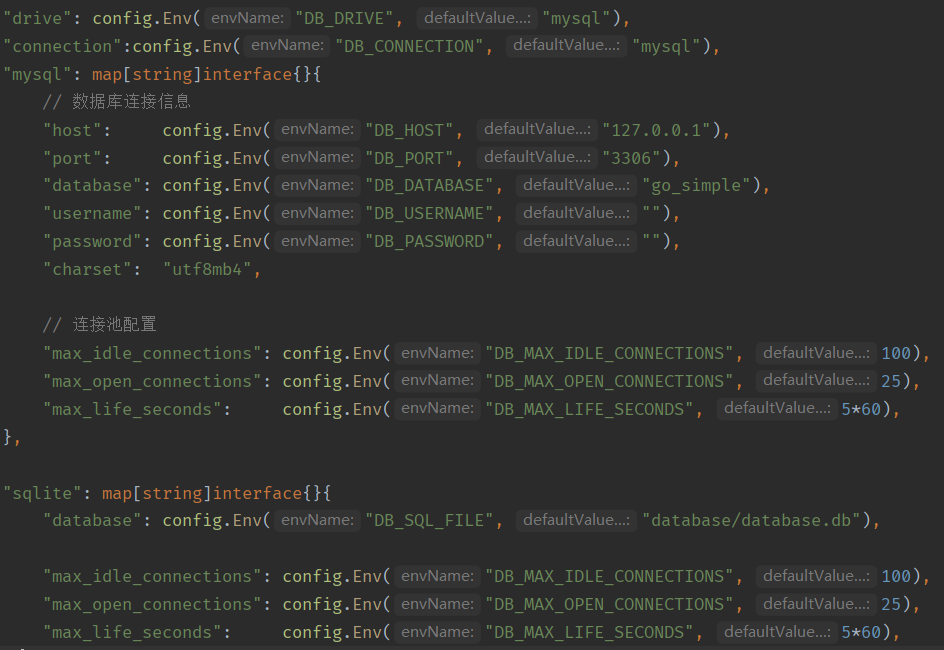
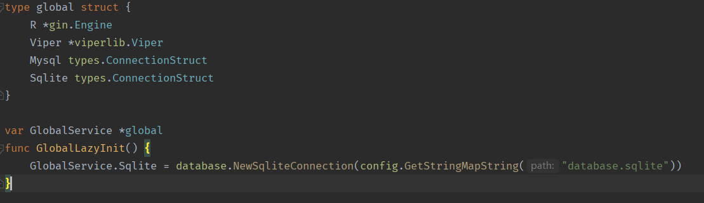
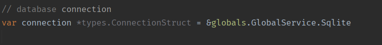

## go-simple

A framework to make golang MVC simple

## 0. go-simple 是什么？

go-simple是用gin搭建的mvc结构框架，是一个web api 快速开发工具，集成了开发中常用的模块，一键生成增删改查api代码和路由，拥有很好的性能。 
普通mvc结构基本一致，不过将业务代码分层到模块中心，对多人协作开发较友好。
 
集成功能：
* JWT Auth认证中间件
* 限流中间件
* zap日志系统
* gorm
* gorm数据库迁移
* 图形验证码
* viper配置
* cobra一键生成api代码

## 1. 目录结构

开发者无需关心过多目录文件，按照目录约定开发即可，所有业务逻辑均在 module 实现。
* app
  * cmd 命令行
  * http 控制器
  * middlewares 全局中间件
  * modules 业务模块中心
    * user_module
      * user gorm模型
      * user_logics 业务层
      * user_policies 授权策略
      * user_services ……
      * user_utils ……
    * shop_module
    * order_module
    * ……
  * request 表单验证
* bootstrap
  * database.go
  * logger.go
  * redis.go
  * route.go
* config
  * app.go
  * captcha.go
  * config.go
  * database.go
  * jwt.go
  * log.go
  * redis.go
* database
* globals 多数据库connections和其它全局变量在此配置
* pkg 公共包
* routes 路由文件
* storage
  * —— logs 日志

## 2. 快速开始
    git clone -b dev https://github.com/zzzphp/go-simple.git test

    go mod download

    go mod tidy

    1. // 使用migrate生成数据库结构
    go run mian.go make migration user
    2. // 填充迁移文件数据 并 添加迁移方法 到 用文件夹 migrations.go Initialize() 方法中

    3. // 执行迁移
    go run mian.go migrate up

    4. // 一键生成模块 注意：控制器根目录为 http/controllers
    // 示例：go run mian.go make module order api/v1
    go run main.go make module [数据表名] [控制器路径...]

    5. // 修改生成的gorm模型结构 和 表单验证结构
    分别在 app/request/xxx.go；app/modules/xxx_module/xxx/xxx_model.go 目录下
    6. 启动
    go run mian.go

生成的代码包含增删改查等基本代码和路由

## 3. 多数据库和模型绑定的使用
1、根目录/config/database.go 配置文件中修改 

注意：该配置不可以删除，除非不使用migrate来管理数据库  
2、增加或修改好配置后，打开 根目录/globals/global.go  

在 global struct 中添加 数据库连接名 如上图，并且在 GlobalLazyInit() 方法中初始化，如上图示例  
3、在模型中 修改 connection 即可

## 4. 适合什么项目使用？

适合中小型项目无需复杂的架构设计、功能简单，增删改查较多，可以减少编写重复代码。 

## 5. 未完成的功能
1. 定时任务
2. 多数据库支持 [ 已添加 ]
3. 断点续传、秒传公共包等
4. rbac api 模块 [ 单独分支可以直接merge使用 ]
5. 查询数据分页、过滤
6. 生成代码模板 策略、语句优化
7. ……
